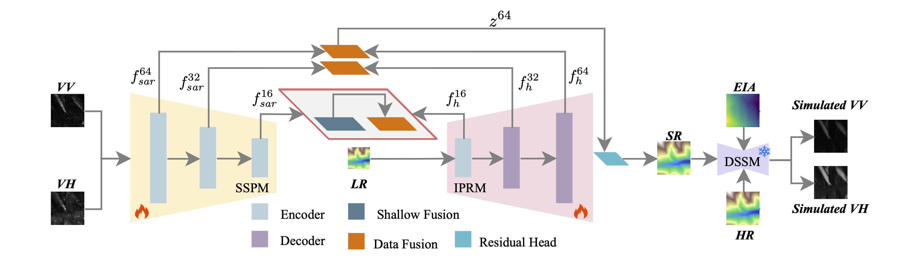

# PIMSR: Physics-Informed Multimodal Super-Resolution

Official PyTorch implementation of **PIMSR**, a physics-informed DEM
super-resolution method that uses co-registered SAR observations to recover
high-resolution elevation details from low-resolution DEM inputs.

PIMSR combines residual DEM reconstruction, multi-scale VV/VH SAR feature fusion, and a differentiable SAR-domain consistency loss. The repository is organized as research code for training, evaluation, ablation, and preparing the HDF5 data used by the model. The pretrained model checkpoint is available for download from the Releases page.

## Highlights

- **SAR-guided DEM super-resolution.** PIMSR takes an LR DEM together with
  co-registered VV and VH SAR patches and predicts a 4x HR DEM.
- **Residual terrain reconstruction.** The model predicts high-frequency
  residual elevation over bicubic upsampling instead of directly regressing the
  complete terrain surface.
- **Multi-scale SAR-DEM fusion.** DEM and SAR features are fused at 16, 32, and
  64 pixel resolutions to combine global terrain structure with local SAR
  backscatter cues.
- **Physics-informed SAR consistency.** A frozen differentiable SAR simulator
  maps predicted DEMs back to the SAR domain, providing an additional
  geometry-aware training signal.
- **Ablation-ready implementation.** SAR input modes, fusion scales, and SAR
  consistency weights can be changed from command-line arguments.

## Method Overview

Given an LR DEM patch, PIMSR first upsamples it with bicubic interpolation. The
network then predicts a residual DEM, and the final super-resolved DEM is

```text
SR DEM = bicubic(LR DEM) + residual.
```

The generator is implemented as `ResidualSARDEMGenerator` in `networks.py`. It
contains three components:

1. A DEM branch with residual blocks, CBAM attention, and gradient-aware DEM
   features.
2. Separate VV and VH SAR branches that produce multi-scale SAR features.
3. A decoder that fuses DEM and SAR representations from coarse to fine scales.

The training objective is

```text
L = lambda_rec * L1(SR DEM, HR DEM) + lambda_sar * L_sar.
```

`L_sar` is computed with a frozen SAR simulator. The simulator generates SAR
responses from both HR and SR DEMs; gradients are propagated only through the SR
DEM branch so that the SAR loss constrains the DEM super-resolution model.

## Repository Layout

```text
PIMSR/
  train.py                         # training entry point
  test.py                          # evaluation and GeoTIFF export
  config.py                        # command-line arguments
  dataset.py                       # HDF5 dataset loader
  networks.py                      # PIMSR generator and SAR consistency loss
  model_blocks.py                  # residual blocks, CBAM, DEM feature modules
  trainer.py                       # train/validation loops
  metrics.py                       # PSNR, SSIM, RMSE, MAE
  visualization.py                 # qualitative results and training curves
  logger.py                        # CSV and text logging

  data_preparation/
    calculate_global_stats.py      # DEM/VV/VH normalization statistics
    preprocess_to_hdf5.py          # pack indexed raster tiles into HDF5

  sar_simulator/
    models.py                      # differentiable SAR simulator
    train_simulator.py             # simulator pretraining
    test_simulator.py              # simulator evaluation
    datasets.py                    # simulator HDF5 loader
    losses.py, metrics.py, utils.py

  run_sar_weight_experiments.py    # SAR loss weight ablation
  run_sar_output_ablation.py       # SAR output ablation
  run_scale_fusion_ablation.py     # fusion scale ablation
  run_structure_ablation_tests.py  # structure ablation runner
```

This release focuses on the PIMSR method. Baseline comparison code is not part
of the public release.

## Installation

The code has been tested with the following environment:

| Package / Environment | Version |
| --- | --- |
| Python | 3.10.19 |
| torch | 2.1.2+cu121 |
| torchvision | 0.16.2+cu121 |
| numpy | 1.26.4 |
| pandas | 2.2.2 |
| h5py | 3.11.0 |
| scikit-image | 0.22.0 |
| matplotlib | 3.8.4 |
| tqdm | 4.67.1 |
| rasterio | 1.4.3 |
| GDAL | 3.10.2 |
| scipy | 1.11.4 |
| pillow | 12.2.0 |

## Data Preparation

PIMSR uses HDF5 files for efficient training and evaluation. Each split should
contain one HDF5 file and one CSV index file.

Expected HDF5 keys:

```text
hr_dem_raw      [N, 64, 64]
lr_dem_raw      [N, 16, 16]
vv_sar_raw      [N, 64, 64]
vh_sar_raw      [N, 64, 64]
inc_angle_map   [N, 64, 64]
```

Expected CSV columns:

```text
dem_path, lr_path, vv_path, vh_path, angle_path
```

Paths in the CSV are interpreted relative to the dataset root used during
preprocessing. The test script also uses `dem_path` to recover GeoTIFF metadata
when exporting predictions.

### Compute Normalization Statistics

Compute global normalization statistics from the training split:

```bash
cd PIMSR
python data_preparation/calculate_global_stats.py
```

This script writes a JSON file containing DEM statistics and log-domain VV/VH
SAR statistics:

```json
{
  "dem": {"mean": 0.0, "std": 1.0},
  "vv_log": {"mean": 0.0, "std": 1.0},
  "vh_log": {"mean": 0.0, "std": 1.0}
}
```

Use the training-set statistics for training, validation, and testing.

### Pack Raster Tiles Into HDF5

After preparing the CSV index, pack raster tiles into HDF5:

```bash
python data_preparation/preprocess_to_hdf5.py
```

Before running the preprocessing scripts, edit the dataset root and output names
near the top of each script to match your local directory structure.

## SAR Simulator

PIMSR uses a pretrained differentiable SAR simulator for the physics-informed
consistency loss. The simulator takes a DEM and an incidence-angle map and
predicts VV/VH SAR responses.

Train the simulator:

```bash
python sar_simulator/train_simulator.py
```

Evaluate the simulator:

```bash
python sar_simulator/test_simulator.py
```

The best simulator checkpoint should be passed to PIMSR training through
`--simulator_weights`. To train PIMSR without SAR consistency, set
`--sar_weight 0`.

## Training

Default training uses VV + VH SAR input, fusion scales `16,32,64`,
reconstruction weight `1.0`, and SAR consistency weight `0.2`.

```bash
cd PIMSR
python train.py \
  --train_h5_path data/train/train_data.h5 \
  --train_csv_path data/train/data_index.csv \
  --val_h5_path data/val/val_data.h5 \
  --val_csv_path data/val/data_index.csv \
  --global_stats data/train/global_stats.json \
  --simulator_weights sar_simulator/output/best_precise_simulator.pth \
  --output_dir results/pimsr \
  --num_epochs 100 \
  --batch_size 16 \
  --learning_rate 1e-4
```

Train a reconstruction-only variant:

```bash
python train.py \
  --sar_weight 0 \
  --output_dir results/pimsr_recon_only
```

Resume from a checkpoint:

```bash
python train.py \
  --resume results/pimsr/checkpoints/checkpoint_epoch_045.pth \
  --output_dir results/pimsr
```

Training outputs are saved under the experiment directory:

```text
results/pimsr/
  checkpoints/
    best_model.pth
    checkpoint_epoch_*.pth
  logs/
    train_log.csv
    val_log.csv
    best_model.txt
    training_summary.txt
  visualizations/
    train_epoch_*.png
    val_epoch_*.png
```

The best checkpoint is selected by validation RMSE.

## Evaluation

Evaluate a trained model:

```bash
python test.py \
  --test_h5_path data/test/test_data.h5 \
  --test_dataset_csv data/test/data_index.csv \
  --global_stats data/train/global_stats.json \
  --model_weights results/pimsr/checkpoints/best_model.pth \
  --output_dir results/pimsr_test \
  --test_data_root data/test \
  --sar_input_mode both \
  --fusion_scales 16,32,64
```

The evaluation script reports PSNR, SSIM, RMSE, and MAE for PIMSR and bicubic
upsampling. It writes:

```text
results/pimsr_test/
  test_summary.txt
  logs/per_sample_test_results.csv
  visualizations/test_sample_*.png
  <geotiff-output-dir>/*.tif
```

To disable GeoTIFF export:

```bash
python test.py ... --no-save_geotiff
```

## Ablation Studies

SAR input ablation:

```bash
python train.py --sar_input_mode none --output_dir results/ablation/sar_none
python train.py --sar_input_mode vv   --output_dir results/ablation/sar_vv
python train.py --sar_input_mode vh   --output_dir results/ablation/sar_vh
python train.py --sar_input_mode both --output_dir results/ablation/sar_both
```

Fusion scale ablation:

```bash
python train.py --fusion_scales 16       --output_dir results/ablation/fusion_16
python train.py --fusion_scales 32       --output_dir results/ablation/fusion_32
python train.py --fusion_scales 64       --output_dir results/ablation/fusion_64
python train.py --fusion_scales 16,32    --output_dir results/ablation/fusion_16_32
python train.py --fusion_scales 16,64    --output_dir results/ablation/fusion_16_64
python train.py --fusion_scales 32,64    --output_dir results/ablation/fusion_32_64
python train.py --fusion_scales 16,32,64 --output_dir results/ablation/fusion_full
```

SAR consistency weight ablation:

```bash
python train.py --sar_weight 0.0 --output_dir results/ablation/sar_weight_0
python train.py --sar_weight 0.1 --output_dir results/ablation/sar_weight_0p1
python train.py --sar_weight 0.2 --output_dir results/ablation/sar_weight_0p2
```

Batch runners are provided for repeated experiments:

```bash
python run_sar_weight_experiments.py --num_epochs 100 --batch_size 16
python run_sar_output_ablation.py --num_epochs 100 --batch_size 16
python run_scale_fusion_ablation.py --num_epochs 100 --batch_size 16
```

Additional training arguments can be appended to the batch runner commands and
will be forwarded to `train.py`.

## Reproducibility Notes

- Use the same `global_stats.json` for train, validation, and test splits.
- Match `--sar_input_mode` and `--fusion_scales` during evaluation to the
  settings used during training.
- Use `--random_seed` to control initialization and dataloader randomness.
- The SAR simulator checkpoint affects the SAR consistency loss; report the
  simulator version together with PIMSR results.

## Results

Please report performance on a fixed split using RMSE, MAE, PSNR, and SSIM.
Fill in the table with the released checkpoint and dataset split used in your
experiments.

| Method | SAR Input | SAR Loss | Fusion Scales | RMSE (m) | MAE (m) | PSNR (dB) | SSIM |
| --- | --- | --- | --- | ---: | ---: | ---: | ---: |
| Bicubic | - | - | - | - | - | - | - |
| PIMSR | VV + VH | no | 16,32,64 | - | - | - | - |
| PIMSR | VV + VH | yes | 16,32,64 | - | - | - | - |
